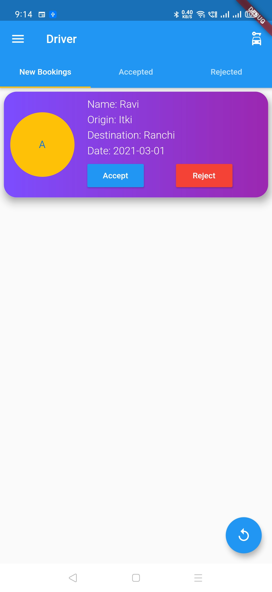
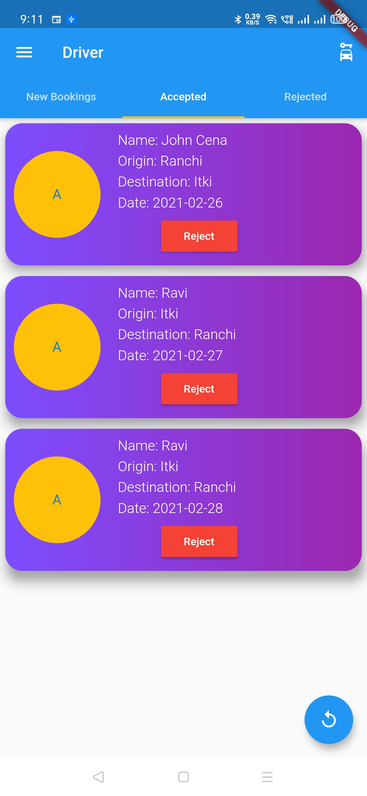

# Car Booking App

Car booking app built using Flutter framework. Utilizes MongoDB as database.

Please refer to this link for code to the api: https://github.com/ravihoro/car_booking_api . 

## Features
- Login/Logout
- Sign up
- Driver's Features
    - View bookings
    - Accept/reject bookings
    - Add car details
    - Save car images
- Customer's Features
    - View bookings
    - Cancel booking
    - Search drivers
    - View driver details
    - Make new booking based on availability

## Tools Used
- Flutter
- Bloc package
- NodeJS
- MongoDB

## Screenshots
                             